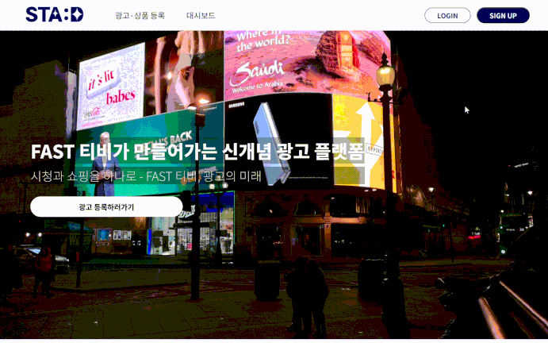
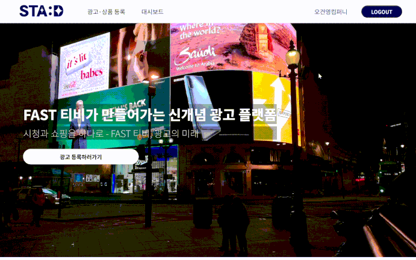
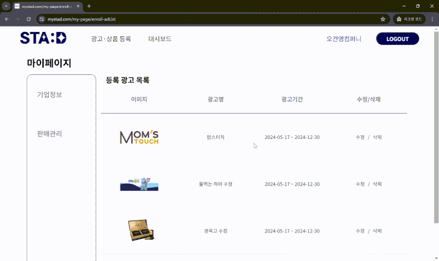
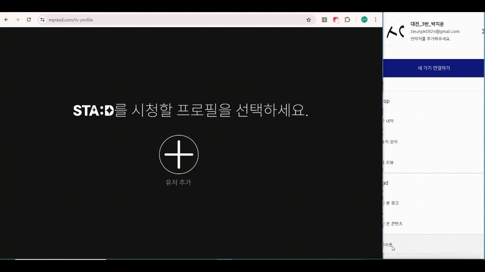
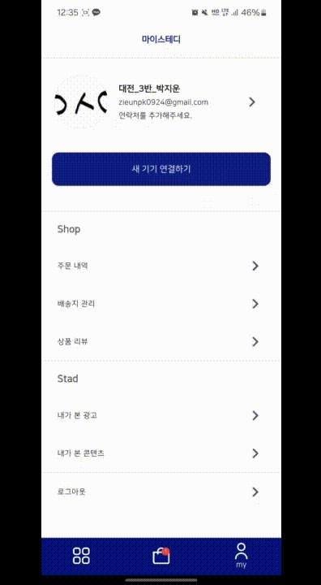
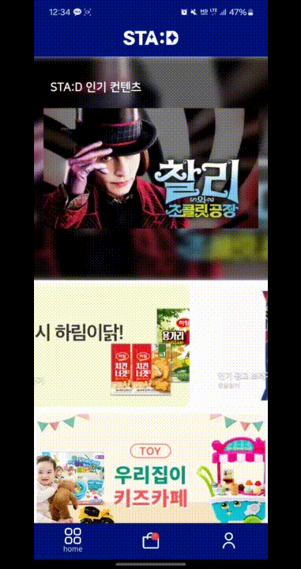
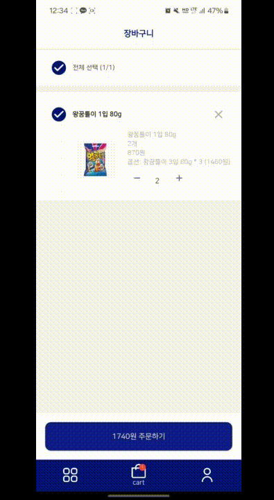

> 당신만을 위한 맞춤형 미디어, STA:D
---


---

###  📅 프로젝트 진행기간
2024.04.08(월) ~ 2024.05.20(월) (30일간 진행)  
SSAFY 10기 2학기 자율 프로젝트 - STA:D

--- 
### 🏅 STA:D - 기획 배경

FAST(Free Advertising Streaming TV) 서비스는 새로운 차세대 케이블로 불리는 서비스로 구독료를 받지 않고 광고를 시청하여 무료로 컨텐츠를 이용할 수 있는 미디어 서비스입니다.

기존의 FAST 서비스에 추가적인 기능들을 더해 새로운 형태의 FAST 서비스를 개발하고자 했습니다.

1. 스마트폰과 IoT
   * 스마트폰을 비롯한 모바일 기기들은 IoT 시대에서 모든 사물에 닿을 수 있는 리모컨의 기능을 합니다.
   * TV를 스마트폰에 연동하여 사용자가 TV의 정보를 스마트폰에서 확인하고 쉽게 활용할 수 있도록 크로스 디바이스 서비스를 기획했습니다.

2. FAST 서비스와 모바일 연동
   * FAST 서비스는 구독료 없이 광고를 시청하여 무료로 콘텐츠를 이용할 수 있는 미디어 서비스로, 시장 규모가 성장할 것으로 예상됩니다.
   * FAST(Free Advertising Streaming TV) 서비스와 모바일을 연동함으로써 더욱 편리하고 향상된 고객 경험을 제공하고자 했습니다.

3. 맞춤 광고와 시너지
   * FAST 서비스의 개인 맞춤 광고를 모바일과 연결했을 때 얻어지는 시너지를 고려했습니다.
   * 사용자는 맞춤 광고를 모바일에서 확인하여 정보를 얻고 쉽게 구매로 이어지는 새로운 고객 경험을 얻을 수 있습니다.
   * FAST 서비스 제공 기업은 광고비 외에도 쇼핑 서비스를 통한 판매 수수료라는 수입원을 추가하여 BM의 다각화를 이루고 사업의 안정성을 높일 수 있습니다.

___
### 🚀 프로젝트 소개
+ STA:D는 개인 맞춤형 광고와 콘텐츠 스트리밍을 제공하며, 모바일 앱과 웹 플랫폼을 통해 사용자와 기업 간의 상호작용을 최적화하는 통합 미디어 서비스입니다.

---
### 🔎 STAD - 개요

**STA:D** - OTT 이용시 맞춤형 광고 제공부터 결제까지 가능한 All-in-One 플랫폼

#### 주요 기능 :
- 버퍼링 없는 대용량 파일 스트리밍
- 사용자 맞춤형 광고 제공
- 광고주를 위한 광고 통계 대시보드 제공
- TV와 휴대폰 디바이스 간 정보 공유
- 다양한 PG사, 결제 수단 제공

**지금 보는 광고가 궁금하다면? STA:D**


--- 

### 🚩 프로젝트 목표
- 사용자 맞춤형 광고 제공하고, 버퍼링 없이 대용량 파일을 스트리밍하는 OTT 서비스를 개발합니다.
- 광고주를 위해 광고 통계 대시보드를, 사용자를 위해 다양한 결제 수단을 제공합니다.
- TV와 휴대폰 디바이스 간에 시청중인 광고와 콘텐츠 정보를 공유합니다.
- 역할을 분담하여 서비스를 코드로 **구현**하고  **배포**합니다.
- 구현하는 과정에서 Front-end와 Back-end가 **협업**하는 과정을 이해합니다.
- RESTful API를 직접 설계하고 API를 통한 HTTP 통신을 겪으며 협업 능력을 기릅니다.
- 자신이 맡은 부분을 설명할 수 있는 의사소통 능력을 기릅니다.
- 단순 구현으로 끝나는 것이 아닌 **코드 리뷰**와 **피드백**을 통해 함께 성장합니다.

---
### 기술스택

#### 개발 환경

 


#### 개발

- ##### BackEnd & Database
  
 
  
 
 
 


- ##### FrontEnd
  


#### CI/CD


 
 


#### 협업 툴
 
 
 
 
 


---
### 백엔드 디렉토리 구조
 ```sh
├─domain
│  ├─advert
│  │  ├─controller
│  │  │  ├─request
│  │  │  └─response
│  │  ├─entity
│  │  ├─repository
│  │  └─service
│  │      └─command
│  │          ├─request
│  │          └─response
│  ├─advertVideo
│  │  ├─controller
│  │  │  ├─request
│  │  │  └─response
│  │  ├─entity
│  │  ├─repository
│  │  └─service
│  │      └─command
│  │          ├─request
│  │          └─response
│  ├─cart
│  │  ├─controller
│  │  │  ├─request
│  │  │  └─response
│  │  ├─entity
│  │  ├─repository
│  │  └─service
│  │      └─command
│  ├─classification
│  │  ├─controller
│  │  ├─dto
│  │  └─service
│  ├─contents
│  │  ├─bookmark
│  │  │  ├─controller
│  │  │  │  ├─request
│  │  │  │  └─response
│  │  │  ├─entity
│  │  │  ├─repository
│  │  │  │  ├─custom
│  │  │  │  └─impl
│  │  │  └─service
│  │  │      └─command
│  │  │          └─request
│  │  ├─category
│  │  │  ├─controller
│  │  │  │  └─response
│  │  │  ├─entity
│  │  │  ├─repository
│  │  │  │  ├─custom
│  │  │  │  └─impl
│  │  │  └─service
│  │  │      └─command
│  │  │          └─request
│  │  ├─categoryRelationship
│  │  │  ├─entity
│  │  │  ├─repository
│  │  │  │  ├─custom
│  │  │  │  └─impl
│  │  │  └─service
│  │  ├─concept
│  │  │  ├─controller
│  │  │  │  ├─request
│  │  │  │  └─response
│  │  │  ├─entity
│  │  │  ├─repository
│  │  │  │  ├─custom
│  │  │  │  └─impl
│  │  │  └─service
│  │  │      └─command
│  │  │          ├─request
│  │  │          └─response
│  │  ├─detail
│  │  │  ├─controller
│  │  │  │  ├─request
│  │  │  │  └─response
│  │  │  ├─entity
│  │  │  ├─repository
│  │  │  │  ├─custom
│  │  │  │  └─impl
│  │  │  └─service
│  │  │      └─command
│  │  │          ├─request
│  │  │          └─response
│  │  ├─label
│  │  │  ├─entity
│  │  │  ├─repository
│  │  │  └─service
│  │  │      └─command
│  │  │          └─request
│  │  ├─labelRelationship
│  │  │  ├─entity
│  │  │  └─repository
│  │  └─watched
│  │      ├─controller
│  │      │  ├─request
│  │      │  └─response
│  │      ├─entity
│  │      ├─repository
│  │      │  ├─custom
│  │      │  └─impl
│  │      └─service
│  │          └─command
│  │              └─request
│  ├─image
│  │  ├─product_image
│  │  │  ├─controller
│  │  │  │  ├─request
│  │  │  │  └─response
│  │  │  ├─entity
│  │  │  ├─repository
│  │  │  └─service
│  │  │      └─command
│  │  └─review_image
│  │      └─entity
│  ├─option
│  │  ├─controller
│  │  │  ├─request
│  │  │  └─response
│  │  ├─entity
│  │  ├─repository
│  │  └─service
│  │      └─command
│  ├─orderProduct
│  │  ├─contoller
│  │  ├─entity
│  │  ├─repository
│  │  └─service
│  ├─orders
│  │  ├─controller
│  │  │  ├─request
│  │  │  └─response
│  │  ├─entity
│  │  ├─repository
│  │  └─service
│  │      └─command
│  │          ├─request
│  │          └─response
│  ├─product
│  │  ├─controller
│  │  │  ├─request
│  │  │  └─response
│  │  ├─entity
│  │  ├─repository
│  │  └─service
│  │      └─command
│  ├─productType
│  │  ├─controller
│  │  │  ├─request
│  │  │  └─response
│  │  ├─entity
│  │  ├─repository
│  │  └─service
│  │      └─command
│  ├─product_review
│  │  ├─controller
│  │  │  ├─request
│  │  │  └─response
│  │  ├─entity
│  │  ├─repository
│  │  └─service
│  │      └─command
│  ├─selectedContent
│  │  ├─entity
│  │  ├─repository
│  │  └─service
│  ├─study
│  │  ├─entity
│  │  └─repository
│  └─user
│      ├─controller
│      │  ├─request
│      │  └─response
│      ├─entity
│      ├─repository
│      └─service
│          └─command
├─global
│  ├─api
│  │  ├─response
│  │  └─service
│  │      └─command
│  ├─auth
│  │  ├─controller
│  │  │  ├─request
│  │  │  └─response
│  │  ├─jwt
│  │  └─service
│  ├─config
│  ├─event
│  ├─Interceptor
│  └─response
│      └─exception
└─util
```

#### Alert
```sh
├─domain
│  ├─alert
│  │  └─controller
│  │      └─event
│  ├─connect
│  │  ├─controller
│  │  │  └─request
│  │  ├─entity
│  │  ├─repository
│  │  └─service
│  │      └─command
│  └─user
│      ├─entity
│      └─service
│          └─dto
└─global
    ├─config
    ├─entity
    ├─response
    │  └─exception
    └─service
        └─command
```

#### python
```shell
├─common
│  └─__pycache__
├─dto
│  └─__pycache__
├─models
├─router
│  └─__pycache__
├─service
│  └─__pycache__
└─__pycache__
```
#### stats
```shell
├─domain
│  └─log
│    ├─controller
│    │  ├─event
│    │  ├─request
│    │  └─response
│    ├─entity
│    ├─repository
│    └─service
│        └─command
└─global
    ├─batch
    ├─config
    └─response
        └─exception
```
#### stream
```shell
├─domain
│  ├─advertVideo
│  │  ├─controller
│  │  ├─entity
│  │  ├─repository
│  │  └─service
│  └─contents
│      └─detail
│          ├─controller
│          │  └─response
│          ├─entity
│          ├─repository
│          └─service
└─global
    ├─config
    ├─event
    └─response
        └─exception
```


### 프론트 디렉토리 구조
#### Web
```sh
├─assets
├─components
│  ├─AdManagement
│  ├─Arrow
│  ├─Button
│  ├─Calendar
│  ├─Carousel
│  ├─Container
│  ├─Enroll
│  ├─Keyboard
│  ├─Modal
│  ├─Nav
│  ├─Select
│  └─Sidebar
├─pages
│  ├─AdEdit
│  ├─AdEnroll
│  ├─AdManagement
│  │  ├─All
│  │  └─Dots
│  ├─Category
│  ├─Landing
│  ├─Main
│  ├─MyPage
│  │  ├─Enterprise
│  │  └─SalesManagement
│  ├─ProductManagement
│  ├─Review
│  ├─Search
│  ├─Streaming
│  ├─TVLogin
│  └─WebLogin
└─store
```

#### App
```sh
├─lib
│  ├─constant
│  │  └─animation
│  ├─model
│  │  └─pg
│  │      ├─danal
│  │      ├─daou
│  │      ├─kcp
│  │      ├─naver
│  │      ├─settle
│  │      └─tosspayments
│  ├─models
│  ├─providers
│  ├─screen
│  │  ├─advert
│  │  ├─cart
│  │  ├─error
│  │  ├─home
│  │  ├─login
│  │  ├─myStad
│  │  │  ├─shop
│  │  │  ├─stad
│  │  │  └─user
│  │  ├─order
│  │  ├─product
│  │  └─review
│  ├─services
│  └─widget
└─test
```

---
## 주요 기능
**1. 스트리밍 서비스**

**버퍼링 없는 대용량 파일 스트리밍을 위해 동영상을 1MB 단위로 나눠 전송**
- **HttpRange**: 클라이언트가 요청한 특정 시점부터 재생할 수 있도록 시작지점에 대한 정보 전달
- **ResourceRegion**: 버퍼링을 최소화하기 위해 시작지점부터 1MB씩 응답
- **Redis**: 다운로드할 url 조회 과정에서 DB connection을 Redis의 Cache를 이용하여 속도 최대 2배 단축
- **Prefetch**: 광고 재생 시간에 백그라운드 다운로드를 통해 콘텐츠 버퍼를 60MB 확보

**2. 맞춤형 광고 제공**

**사용자의 최근 시청 영상을 기반으로 맞춤형 광고 제공**
- **Word2Vector**: 텍스트에서 단어를 벡터로 추출하여 벡터 간 유사도를 반영
- **LSTM**: 이전 입력 데이터를 기억해 다음 출력값을 결정
- **AD Queue**: YouTube 구독채널 정보 및 최근 시청 영상을 활용한 추천

**3. 대시보드**

**광고주가 게시한 광고에 대한 신뢰도 높고 효율적인 통계 자료를 빠르게 제공**
- **Spring Batch**: 광고주에게 광고와 판매에 대한 통계 데이터 제공
- **성능 개선**: SpringBatch 로그 기록 자동화를 통해 기존 방식보다 160배 성능 향상

**4. 크로스 디바이스**

**SSE connect 정보를 Event 송신 방식으로 TV와 휴대폰 간에 공유**

**5. 결제 서비스**

**다양한 PG사와 결제 수단 제공**
- **PortOne API**: 사업자 번호 없이 테스트 환경으로 다양한 PG사와 결제 수단을 도입하고 실제 결제부터 자동 환불까지 가능


---

### 프로젝트 산출물

- [기능명세서](docs/프로젝트%20산출물/기능명세서.md)
- [시스템 아키텍처](docs/프로젝트%20산출물/시스템아키텍처.md)
- [와이어프레임](docs/프로젝트%20산출물/와이어프레임.md)
- [ERD](docs/프로젝트%20산출물/ERD.md)
- [API 명세서](docs/프로젝트%20산출물/API명세서.md)
- [BE 코드 컨벤션](docs/프로젝트%20산출물/BE코드컨벤션.md)
---
### 프로젝트 결과물

- [중간 발표자료](docs/프로젝트%20발표자료/중간발표.md)
- [최종 발표자료](docs/프로젝트%20발표자료/최종발표.md)

---

### 팀원 소개
### Contributors

<table style="width: 100%; text-align: center;">
  <tr>
    <td style="text-align: center;"><br><strong>이태경</strong><br>🍪Back-end<br>💎Team Leader</td>
    <td style="text-align: center;"><br><strong>최은희</strong><br>💟Back-end</td>
    <td style="text-align: center;"><br><strong>이민형</strong><br>🧗‍♂️Back-end</td>
  </tr>
  <tr>
    <td style="text-align: center;"><br><strong>박지운</strong><br>🍖Back-end</td>
    <td style="text-align: center;"><br><strong>김은지</strong><br>🌹Front-end<br></td>
    <td style="text-align: center;"><br><strong>이서윤</strong><br>🍞Front-end</td>
  </tr>
</table>

---
## STA:D 서비스 화면

### 기업 WEB
<table style="width: 100%; text-align: center; border-collapse: collapse;" >
  <tr>
    <td style="text-align: center;"><h3>로그인</h3></td>
    <td style="text-align: center;"><h3>광고 & 상품 추가</h3></td>
  </tr>
  <tr>
    <td style="text-align: center;"><h3>광고 & 상품 조회</h3></td>
    <td style="text-align: center;"><h3>광고 & 상품 수정</h3></td>
  </tr>
  <tr>
    <td style="text-align: center;"><h3>광고 & 상품 대시보드</h3></td>
  </tr>
</table>

### 크로스디바이스 서비스
<table style="width: 100%; text-align: center; border-collapse: collapse;" >
  <tr>
    <td style="text-align: center;"><h3>QR 로그인</h3></td>
  </tr>
  <tr>
    <td style="text-align: center;"><h3>콘텐츠 재생시 앱연동</h3></td>
  </tr>
  <tr>
    <td style="text-align: center;"><h3>앱에서 컨텐츠 재생 명령</h3></td>
  </tr>
  <tr>
    <td style="text-align: center;"><h3>앱에서 컨텐츠 정보 조회</h3></td>
  </tr>
  <tr>
    <td style="text-align: center;"><h3>앱에서 광고 상품 구매페이지 이동</h3></td>
  </tr>
</table>

### APP 서비스
<table style="width: 100%; text-align: center; border-collapse: collapse;" >
  <tr>
    <td style="text-align: center; width: 50%;"><h3>로그인</h3></td>
    <td style="text-align: center; width: 50%;"><h3>배송지 추가</h3></td>
  </tr>
  <tr>
    <td style="text-align: center;"><h3>장바구니 담기</h3></td>
    <td style="text-align: center;"><h3>장바구니 상품 결제</h3></td>
  </tr>
</table>

### TV 서비스
<table style="width: 100%; text-align: center; border-collapse: collapse;" >
  <tr>
    <td style="text-align: center;"><h3>로그인</h3></td>
    <td style="text-align: center;"><h3>내주변 베리어프리 장소 표시</h3></td>
  </tr>
  <tr>
    <td style="text-align: center;"><h3>베리어프리 장소 검색하기</h3></td>
    <td style="text-align: center;"><h3>베리어프리 리뷰 작성하기</h3></td>
  </tr>
  <tr>
    <td style="text-align: center;"><h3>장소 즐겨찾기, 내가 쓴 글 열람</h3></td>
    <td style="text-align: center;"><h3>도보 길찾기</h3></td>
  </tr>
  <tr>
    <td style="text-align: center;"><h3>대중교통 길찾기</h3></td>
    <td style="text-align: center;"><h3>택시 요금 길찾기 & 요금안내</h3></td>
  </tr>
  <tr>
    <td style="text-align: center;"><h3>장애인 콜택시 전화 연결</h3></td>
  </tr>
</table>
